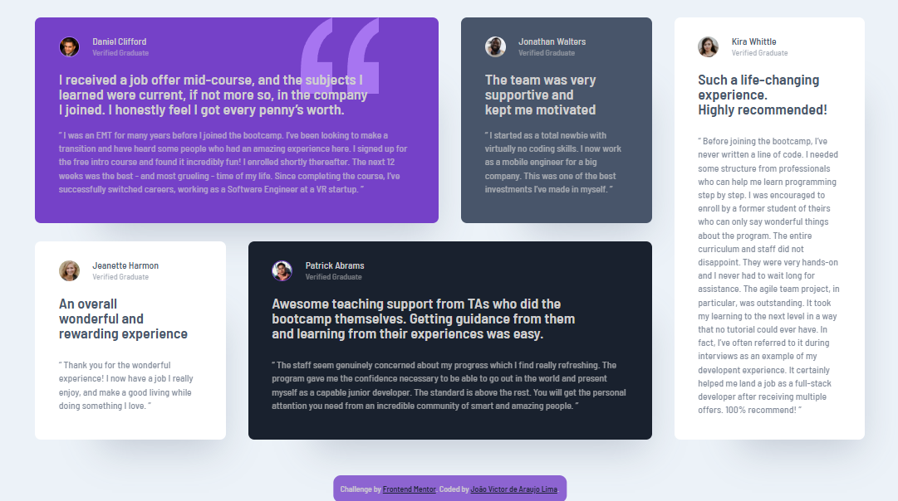

# Frontend Mentor - Four card feature section solution

## Languages
This first section is in English. 

[Versão em português logo abaixo.](#portuguese)

## Context

This is a solution to the [Four card feature section challenge on Frontend Mentor](https://www.frontendmentor.io/challenges/four-card-feature-section-weK1eFYK). Frontend Mentor challenges help you improve your coding skills by building realistic projects.

> Your challenge is to build out this feature section and get it looking as close to the design as possible.

## Table of contents

- [Overview](#overview)
  - [The challenge](#the-challenge)
  - [Screenshot](#screenshot)
  - [Links](#links)
- [My process](#my-process)
  - [Built with](#built-with)
  - [What I learned](#what-i-learned)
  - [Useful resources](#useful-resources)
- [Author](#author)

## Overview

### The challenge

Users should be able to:

- View the optimal layout for the site depending on their device's screen size

### Screenshot

#### Desktop

<p align="center">
  
</p>

#### Tablet

<p align="center">
  
</p>

#### Mobile

<p align="center">
  
</p>

### Links

- Solution URL: [GitHub Repository](https://your-solution-url.com)
- Live Site URL: [Live Page](https://your-live-site-url.com)

## My process

### Built with

- Semantic HTML5 markup
- CSS custom properties
- Flexbox
- CSS Grid
- Media Query + clamp()

### What I learned

In this project I was able to use flexbox, grid, variable, and media query concepts in CSS, as well as using a ready-made Figma design to create this component. I also used `rem` for measurements and BEM methodology for naming classes.

This was also my first time using `clamp()` for responsiveness.

```css
:root {
  /* TEXT PRESET 1 - HEADER */
  --text-header-size: clamp(2.4rem, calc(1.2rem + 3.8vw), 3.6rem);
}
```

### Useful resources

- [Font-size Clamp Generator](https://clamp.font-size.app/) - This helped me choose values ​​to put in my clamp() functions.

## Author

- Website - [João Víctor de Araujo Lima's Portfolio](https://xuaun.github.io/)
- Frontend Mentor - [@xuaun](https://www.frontendmentor.io/profile/xuaun)

____
<br>

# <p id="portuguese">Frontend Mentor - Solução do projeto de seção com quatro cards</p>

## Contexto

Esta é uma solução para o [desafio de seção com quatro cards no Frontend Mentor](https://www.frontendmentor.io/challenges/qr-code-component-iux_sIO_H). Os desafios do Frontend Mentor ajudam você a melhorar suas habilidades de codificação construindo projetos realistas.

> Seu desafio é criar essa seção com quatro cards e fazer com que ela tenha a aparência mais próxima possível do design.

## Lista de conteúdos

- [Visão Geral](#visão-geral)
  - [Desafio](#desafio)
  - [Prints](#prints)
  - [Links](#links-pt)
- [Meu processo](#meu-processo)
  - [Tecnologias utilizadas](#tecnologias-utilizadas)
  - [O que eu aprendi](#o-que-eu-aprendi)
  - [Recursos úteis](#recursos-úteis)
- [Autor](#autor)

## Visão Geral

### Desafio

Os usuários devem ser capazes de:

- Visualizar o layout ideal dependendo do tamanho da tela do dispositivo

### Prints

#### Computador

<p align="center">
  
</p>

#### Tablet

<p align="center">
  
</p>

#### Celular

<p align="center">
  
</p>

### <p id="links-pt">Links</p>

- Link da solução: [Repositório no GitHub](https://your-solution-url.com)
- Site com a solução: [Página no ar](https://your-live-site-url.com)

## Meu processo

### Tecnologias utilizadas

- HTML5
- CSS
- Flexbox
- CSS Grid
- Media Query + clamp()

### O que eu aprendi

Neste projeto eu pude utilizar conceitos de flexbox e grid, de variáveis e de media query no CSS, além de usar um design pronto do Figma para a elaboração deste componente. Eu também usei `rem` para medidas e metodologia BEM para nomear classes.

Esta também foi minha primeira vez usando clamp() para responsividade.

```css
:root {
  /* TEXT PRESET 1 - HEADER */
  --text-header-size: clamp(2.4rem, calc(1.2rem + 3.8vw), 3.6rem);
}
```

### Recursos úteis

- [Font-size Clamp Generator](https://clamp.font-size.app/) - Este link me ajudou a escolher valores para colocar nas minhas funções `clamp()`.

## Autor

- Website - [Portfólio - João Víctor de Araujo Lima](https://xuaun.github.io/)
- Frontend Mentor - [@xuaun](https://www.frontendmentor.io/profile/xuaun)

